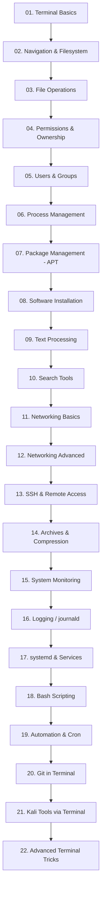

# 🐉 Kali Linux Terminal Mastery

**From Zero to Advanced — Master the Kali Linux Terminal Without Needing Any Other Source**


---

## 📖 এই Repository টা কী?

এটা একটা **pure terminal-focused** Kali Linux শেখার repository। এখানে থিওরি কম, **কমান্ড বেশি** — প্রতিটা কমান্ড দেখানো হবে:

- এটা **কী** এবং কেন লাগে
- **সঠিক syntax**
- একটা **real demo command**
- **actual output** (terminal screenshot বা text output)
- ব্যাখ্যা — output এর প্রতিটা লাইনের মানে কী
- Common mistakes + troubleshooting

লক্ষ্য একটাই: **এই repo-তে ঢুকে কেউ যেন বাইরের কোনো টিউটোরিয়াল/ভিডিও ছাড়াই সম্পূর্ণ Kali terminal control শিখতে পারে — basic থেকে advanced।**

---

## 🗺️ Learning Roadmap



## 📂 Repository Structure

```text
Kali-Linux-Terminal-Mastery/
│
├── README.md                     ← এই ফাইল
├── command-reference/            ← 🔑 সব কমান্ড এক জায়গায় (master file)
├── resources/                    ← Suggested videos, websites, docs
├── assets/                       ← Screenshots, diagrams
│
├── 01-terminal-basics/
├── 02-navigation-filesystem/
├── 03-file-operations/
├── 04-permissions-ownership/
├── 05-users-groups/
├── 06-process-management/
├── 07-package-management-apt/
├── 08-software-installation/
├── 09-text-processing/
├── 10-search-tools/
├── 11-networking-basics/
├── 12-networking-advanced/
├── 13-ssh-remote-access/
├── 14-archives-compression/
├── 15-system-monitoring/
├── 16-logging-journald/
├── 17-systemd-services/
├── 18-bash-scripting/
├── 19-automation-cron/
├── 20-git-terminal/
├── 21-kali-tools-terminal/
└── 22-advanced-terminal-tricks/
```

## 🔑 সবচেয়ে গুরুত্বপূর্ণ ফাইল: Command Reference

👉 **[`command-reference/00-master-command-index.md`](command-reference/00-master-command-index.md)**

এখানে repo-র **সব কমান্ড একসাথে ক্যাটাগরি অনুযায়ী** লিস্ট করা থাকবে (কমান্ড + এক লাইন কাজ + কোন module-এ ফুল ডেমো আছে তার লিংক) — একটা quick cheat-sheet হিসেবে ব্যবহার করা যাবে।

## 🎥 Learning Resources

👉 [`resources/videos-and-websites.md`](resources/videos-and-websites.md) — বাছাই করা official docs, video channel, এবং practice platform এর লিস্ট।

## ✅ প্রতিটা Lesson-এ যা যা থাকবে

প্রতিটা কমান্ড lesson এই format ফলো করবে:

```markdown
## command_name

**কী কাজ করে:** ...
**Syntax:** `command [options] [arguments]`

### 🖥️ Demo
$ actual command
(actual output)

### 📤 Output ব্যাখ্যা
...

### ⚙️ গুরুত্বপূর্ণ Options
...

### ⚠️ সাবধানতা / Common Mistake
...
```

## 🧭 কীভাবে শুরু করবে

1. [`01-terminal-basics/`](01-terminal-basics/README.md) থেকে শুরু করো
2. প্রতিটা কমান্ড নিজে টাইপ করে দেখো — শুধু পড়ে গেলে হবে না
3. `command-reference/` ফাইলটা bookmark করে রাখো — বারবার লাগবে
4. একটা module শেষ হলে পরের module-এ যাও, ক্রম ভাঙবে না

---

⚠️ **Authorized Use Only:** Module 21 (Kali Tools via Terminal) থেকে যেসব security tool শেখানো হবে, সেগুলো শুধু নিজের VM/lab/authorized environment-এ ব্যবহার করবে।

---

Maintained by **Atia** ([GitHub: AtiaAbk](https://github.com/AtiaAbk))
