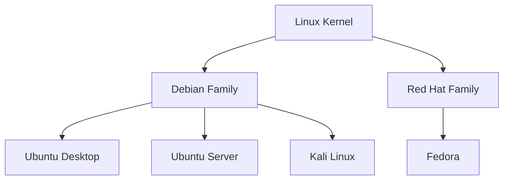

# 🐧 Linux Terminal Mastery

### One Repository, Four Distributions — Master the Linux Command Line Across Ubuntu, Kali, and Fedora

[](LICENSE)
[](#-distributions-covered)
[](https://www.markdownguide.org/)
[](#)
[](https://www.linkedin.com/in/atia-sanjida-085947233/)

> A single, structured learning path for the Linux terminal — built once, applied across every major distribution family. Install each OS in a VM, then build the exact same command-line skills whether you're on a Debian-based desktop, a headless server, a penetration-testing distro, or a Red Hat–based system.

**Author:** [Atia Sanjida](https://www.linkedin.com/in/atia-sanjida-085947233/) · **Contact:** [atia.abk@gmail.com](mailto:atia.abk@gmail.com)

---

## 📖 Table of Contents

1. [Why This Repository Exists](#-why-this-repository-exists)
2. [Distributions Covered](#-distributions-covered)
3. [Repository Structure](#-repository-structure)
4. [Setting Up Your Lab (VM Installation)](#-setting-up-your-lab-vm-installation)
5. [How the Distributions Differ](#-how-the-distributions-differ)
6. [Terminal Fundamentals (Common to All)](#-terminal-fundamentals-common-to-all)
7. [Package Managers — One Concept, Four Syntaxes](#-package-managers--one-concept-four-syntaxes)
8. [Core Command Reference](#-core-command-reference)
9. [Permissions, Users & Services](#-permissions-users--services)
10. [Networking Basics](#-networking-basics)
11. [Distro-Specific Guides](#-distro-specific-guides)
12. [Learning Path](#-learning-path)
13. [Cheat Sheets](#-cheat-sheets)
14. [About the Author](#-about-the-author)
15. [License](#-license)

---

## 🎯 Why This Repository Exists

Most Linux tutorials teach *one* distribution and leave you stuck when you meet another. In the real world, you'll move between:

- A **desktop distro** for daily use and learning
- A **server distro** with no GUI at all
- A **security-focused distro** for penetration testing
- A **Red Hat–family distro** used heavily in enterprise environments

The terminal — navigation, permissions, processes, networking, scripting — is **90% identical** across all of them. This repository teaches that shared core once, then documents the small but important differences (package managers, default tools, philosophy) per distribution.

## 🖥️ Distributions Covered

| Distribution | Family | Primary Use Case | Package Manager |
|---|---|---|---|
| **Ubuntu Desktop** | Debian-based | Learning, daily-driver workstation | `apt` |
| **Ubuntu Server** | Debian-based | Headless servers, cloud, production | `apt` |
| **Kali Linux** | Debian-based | Penetration testing, security research | `apt` |
| **Fedora** | Red Hat–based | Cutting-edge desktop, RHEL-adjacent admin skills | `dnf` |

<!-- 
## 📁 Repository Structure

```
Linux-Terminal-Mastery/
├── README.md                     ← you are here (common guide + hub)
├── LICENSE
│
├── common/                       ← shared across ALL distros
│   ├── terminal-basics.md
│   ├── permissions.md
│   ├── package-managers.md
│   ├── networking.md
│   ├── shell-scripting.md
│   ├── troubleshooting.md
│   └── cheatsheets/
│       └── universal-commands.md
│
├── ubuntu-desktop/
│   └── README.md                 ← VM install guide + desktop-specific notes
│
├── ubuntu-server/
│   └── README.md                 ← VM install guide + server-specific notes
│
├── kali-linux/
│   └── README.md                 ← VM install guide + security-tooling notes
│
├── fedora/
│   └── README.md                 ← VM install guide + dnf/RHEL-family notes
│
└── images/                       ← screenshots, diagrams
```
This is a comment -->


> **How to use this repo:** Start here for anything common to all four distros (permissions, navigation, scripting, networking). Go into a distro's own folder only for installation steps and that distro's unique quirks.

## 💿 Setting Up Your Lab (VM Installation)

All four distributions in this repo are meant to be run as **virtual machines** — safe, disposable, and identical in behavior to real hardware for terminal practice.

### 1. Choose a Hypervisor

| Hypervisor | Platform | Notes |
|---|---|---|
| **VirtualBox** | Windows / macOS / Linux | Free, beginner-friendly, most widely documented |
| **VMware Workstation Player** | Windows / Linux | Free for personal use, slightly better performance |
| **UTM** | macOS (Apple Silicon) | Best option on M1/M2/M3 Macs |
| **virt-manager (KVM)** | Linux host | Best performance if your host is already Linux |

### 2. Download the ISOs

| Distro | Download |
|---|---|
| Ubuntu Desktop | https://ubuntu.com/download/desktop |
| Ubuntu Server | https://ubuntu.com/download/server |
| Kali Linux | https://www.kali.org/get-kali/ |
| Fedora Workstation | https://fedoraproject.org/workstation/download |

### 3. Recommended VM Specs (per machine)

| Resource | Minimum | Recommended |
|---|---|---|
| RAM | 2 GB | 4 GB |
| Disk | 20 GB | 40 GB |
| CPU | 2 cores | 2–4 cores |
| Network | NAT | NAT + Host-Only (for isolated lab practice) |

### 4. General VM Creation Steps (same for all four)

1. Open your hypervisor → **New Virtual Machine**.
2. Select the downloaded ISO as the boot media.
3. Allocate RAM/CPU/disk per the table above.
4. Boot the VM and run the OS installer (each distro's exact installer steps are in its own folder — see [Distro-Specific Guides](#-distro-specific-guides)).
5. After install, take a **snapshot** immediately — this gives you a clean checkpoint to roll back to if you break something while practicing (which you should do, on purpose, often).
6. Install guest additions/tools for better performance:
   - VirtualBox: **Devices → Insert Guest Additions CD**
   - VMware: **VM → Install VMware Tools**

> 💡 **Tip:** Run all four VMs side by side (if your host has the RAM) so you can directly compare command output between distributions as you learn.

## 🔍 How the Distributions Differ



| Aspect | Ubuntu Desktop | Ubuntu Server | Kali Linux | Fedora |
|---|---|---|---|---|
| GUI by default | ✅ Yes (GNOME) | ❌ No | ✅ Yes (XFCE/GNOME) | ✅ Yes (GNOME) |
| Default user | Standard user + sudo | Standard user + sudo | `root`-oriented (modern Kali: standard user) | Standard user + sudo |
| Package manager | `apt` | `apt` | `apt` | `dnf` |
| Init system | systemd | systemd | systemd | systemd |
| Firewall tool | `ufw` | `ufw` | `ufw` (often disabled for testing) | `firewalld` |
| Update cycle | LTS, stable | LTS, stable | Rolling release | Semi-rolling (~13 months/version) |
| Typical role | Learning, workstation | Production/cloud servers | Offensive security | Enterprise-adjacent desktop/dev |

## ⚡ Terminal Fundamentals (Common to All)

These work **identically** on every distro in this repo — full depth in [`common/terminal-basics.md`](common/terminal-basics.md).

| Category | Commands |
|---|---|
| Navigation | `pwd`, `cd`, `ls`, `tree` |
| File operations | `cp`, `mv`, `rm`, `mkdir`, `touch` |
| Viewing files | `cat`, `less`, `head`, `tail` |
| Searching | `grep`, `find`, `locate` |
| Permissions | `chmod`, `chown` |
| Processes | `ps`, `top`, `htop`, `kill` |
| Text processing | `sed`, `awk`, `cut`, `sort`, `uniq` |
| Compression | `tar`, `zip`, `gzip` |
| Networking | `ip`, `ping`, `ss`, `ssh`, `scp` |
| System info | `df`, `du`, `free`, `uptime`, `uname -a` |

## 📦 Package Managers — One Concept, Four Syntaxes

Same task, different command — this is usually the *only* thing that changes between distros day-to-day.

| Task | Ubuntu / Kali (`apt`) | Fedora (`dnf`) |
|---|---|---|
| Update package index | `sudo apt update` | `sudo dnf check-update` |
| Upgrade all packages | `sudo apt upgrade` | `sudo dnf upgrade` |
| Install a package | `sudo apt install nginx` | `sudo dnf install nginx` |
| Remove a package | `sudo apt remove nginx` | `sudo dnf remove nginx` |
| Search for a package | `apt search nginx` | `dnf search nginx` |
| List installed packages | `apt list --installed` | `dnf list installed` |
| Show package info | `apt show nginx` | `dnf info nginx` |

Full guide: [`common/package-managers.md`](common/package-managers.md)

## 📋 Core Command Reference

```bash
# Navigation
pwd                      # print working directory
cd /var/log               # change directory
ls -lah                   # list all files, long format

# Files
cp -r project/ backup/    # copy directory
mv old.txt new.txt        # rename/move
rm -r folder/             # remove directory
mkdir -p a/b/c             # create nested dirs

# Searching
grep -rn "ERROR" .          # search text recursively
find . -name "*.log"        # find files by name

# Permissions
chmod 750 script.sh          # set permissions
chown user:group file        # change ownership

# Processes
ps aux | grep nginx          # find a process
top                           # live resource monitor
kill -15 PID                  # graceful stop

# Networking
ip a                          # show interfaces
ssh user@host                  # remote login
```

## 🔐 Permissions, Users & Services

Fully identical concepts across all four distros (permission bits, `useradd`, `systemctl`) — full breakdown in [`common/permissions.md`](common/permissions.md). The only difference is the **firewall tool**: `ufw` on the Debian-family distros vs `firewalld` on Fedora.

## 🌐 Networking Basics

Covered in depth, distro-agnostic, in [`common/networking.md`](common/networking.md) — `ip`, `ping`, `ss`, `ssh`, `scp`, `rsync`, and reading `/etc/resolv.conf`.

## 🗂️ Distro-Specific Guides

Each folder below contains a **VM installation walkthrough** plus what's unique to that distribution:

| Folder | Contents |
|---|---|
| [`ubuntu-desktop/`](ubuntu-desktop/README.md) | VM install steps, GUI vs terminal workflow, everyday-use tips |
| [`ubuntu-server/`](ubuntu-server/README.md) | Headless VM install, SSH-only access, service hosting basics |
| [`kali-linux/`](kali-linux/README.md) | VM install, security tooling overview, safe/legal-use notice |
| [`fedora/`](fedora/README.md) | VM install steps, `dnf`/`firewalld` specifics, SELinux basics |

## 🗺️ Learning Path

| Stage | Focus |
|---|---|
| **1. Foundations** | Install Ubuntu Desktop in a VM → master navigation, files, permissions |
| **2. Server Skills** | Install Ubuntu Server → practice headless administration over SSH |
| **3. Security Awareness** | Install Kali Linux → explore terminal-based security tooling (ethically, on your own lab only) |
| **4. Cross-Distro Fluency** | Install Fedora → notice what changes (`dnf`, `firewalld`, SELinux) and what doesn't |

## 📑 Cheat Sheets

See [`common/cheatsheets/universal-commands.md`](common/cheatsheets/universal-commands.md) for a printable one-pager that works on all four distributions.

## ✍️ About the Author

| | |
|---|---|
| **Name** | Atia Sanjida |
| **Email** | [atia.abk@gmail.com](mailto:atia.abk@gmail.com) |
| **LinkedIn** | [linkedin.com/in/atia-sanjida](https://www.linkedin.com/in/atia-sanjida-085947233/) |
| **GitHub** | [github.com/AtiaAbk](https://github.com/AtiaAbk) |

This repository is part of an ongoing cybersecurity and systems engineering portfolio. Feedback, corrections, and collaboration inquiries are welcome via any of the channels above.

## 📄 License

This project is licensed under the [MIT License](LICENSE) — © 2026 Atia Sanjida.

---

<p align="center">
  <sub>Built and maintained by <a href="https://www.linkedin.com/in/atia-sanjida-085947233/">Atia Sanjida</a> — if this repository helped you, consider starring it ⭐</sub>
</p>
