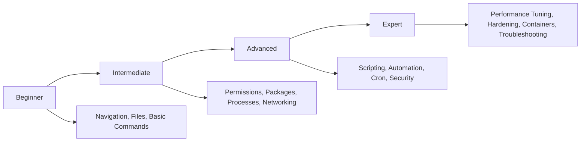
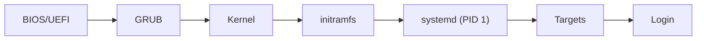

# 🐧 Ubuntu Terminal Mastery

### The Complete Guide to Becoming Proficient on the Linux Command Line — No GUI Required

[](LICENSE)
[](https://ubuntu.com)
[](https://www.markdownguide.org/)
[](CONTRIBUTING.md)
[](#)

> A structured, hands-on curriculum that takes you from "I've never opened a terminal" to "I administer Linux servers professionally" — entirely through the command line.

**Created & maintained by [Atia Sanjida](https://linkedin.com/in/atia_sanjida)**

---

## 📖 Table of Contents

1. [Introduction](#-introduction)
2. [Why Learn the Linux Terminal](#-why-learn-the-linux-terminal)
3. [Who This Is For](#-who-this-is-for)
4. [Learning Path](#-learning-path)
5. [Ubuntu Installation Guide](#-ubuntu-installation-guide)
6. [Desktop vs Server, GUI vs CLI](#-desktop-vs-server-gui-vs-cli)
7. [Linux Boot Process Overview](#-linux-boot-process-overview)
8. [Linux Filesystem Overview](#-linux-filesystem-overview)
9. [Terminal Basics & Shortcuts](#-terminal-basics--shortcuts)
10. [Navigation Commands](#-navigation-commands)
11. [Top Daily-Used Commands](#-top-daily-used-commands)
12. [Package Management](#-package-management)
13. [Users, Groups, Permissions & Ownership](#-users-groups-permissions--ownership)
14. [Process & Service Management](#-process--service-management)
15. [Networking & SSH](#-networking--ssh)
16. [Disk Management & Compression](#-disk-management--compression)
17. [Searching Files & Text](#-searching-files--text)
18. [Text Editors](#-text-editors)
19. [Environment Variables, Aliases & Shell Config](#-environment-variables-aliases--shell-config)
20. [Cron Jobs & Timers](#-cron-jobs--timers)
21. [Logs & Troubleshooting](#-logs--troubleshooting)
22. [Firewall & Security](#-firewall--security)
23. [Shell Scripting & Automation](#-shell-scripting--automation)
24. [Pipes, Redirection & Regex](#-pipes-redirection--regex)
25. [Repository Structure](#-repository-structure)
26. [Cheat Sheets](#-cheat-sheets)
27. [Real Projects & Exercises](#-real-projects--exercises)
28. [Interview Questions](#-interview-questions)
29. [Further Reading & References](#-further-reading--references)

---

## 🎯 Introduction

**Ubuntu Terminal Mastery** is a self-contained learning repository built to teach the Linux command line the way working system administrators, DevOps engineers, and backend developers actually use it — through repetition, real examples, and progressively harder problems.

Every topic follows the same format: **concept → syntax → example → real output → common mistakes → what to learn next.** No filler, no assumed knowledge.

## 💡 Why Learn the Linux Terminal

| Reason | Why It Matters |
|---|---|
| **Speed** | Most sysadmin/DevOps tasks are 10–50x faster in a terminal than a GUI. |
| **Automation** | Anything you can type, you can script. GUIs don't scale. |
| **Servers have no GUI** | The vast majority of production Linux servers are headless. |
| **Industry standard** | Cloud (AWS/GCP/Azure), Docker, Kubernetes, and CI/CD are all terminal-first. |
| **Portability** | The same skills work on Ubuntu, Debian, RHEL, WSL, and macOS. |
| **Deeper understanding** | The CLI exposes how the OS actually works; the GUI hides it. |

## 👥 Who This Is For

Complete beginners · Students · Linux enthusiasts · Developers · System administrators · DevOps engineers · Cybersecurity learners · Cloud engineers

No prior Linux experience is assumed. Basic comfort with a keyboard is enough.

## 🗺️ Learning Path



| Stage | Focus | Est. Time |
|---|---|---|
| **Beginner** | Navigation, file operations, basic commands | 1–2 weeks |
| **Intermediate** | Permissions, package management, processes, networking basics | 2–4 weeks |
| **Advanced** | Shell scripting, automation, cron, security hardening | 4–6 weeks |
| **Expert** | Performance tuning, containers, deep troubleshooting, production ops | Ongoing |

Full breakdown: [`learning-roadmap.md`](learning-roadmap.md)

## 💿 Ubuntu Installation Guide

- **Bare metal / dual boot:** Flash the [Ubuntu ISO](https://ubuntu.com/download/desktop) with `dd` or Rufus/BalenaEtcher, boot from USB, follow the installer.
- **Virtual machine:** Use VirtualBox, VMware, or `virt-manager` — best for safe practice.
- **WSL (Windows):**
  ```bash
  wsl --install -d Ubuntu
  ```
- **Cloud VM:** Spin up an Ubuntu droplet/instance on DigitalOcean, AWS EC2, or GCP — closest to real production experience.

**Ubuntu versions:** LTS releases (20.04, 22.04, 24.04) get 5 years of support and are recommended for learning and production. Interim releases (e.g., 23.10) get 9 months and are for testing newer packages.

## 🖥️ Desktop vs Server, GUI vs CLI

| | Ubuntu Desktop | Ubuntu Server |
|---|---|---|
| GUI | Yes (GNOME) | No (CLI only by default) |
| Resource usage | Higher | Minimal |
| Typical use | Workstation, learning | Production servers, cloud, containers |

The terminal exists identically on both — this repo trains you to be equally effective on either, and fully self-sufficient on Server.

## 🥾 Linux Boot Process Overview



1. **BIOS/UEFI** — hardware initialization, hands off to the bootloader.
2. **GRUB** — bootloader; selects kernel/OS.
3. **Kernel + initramfs** — kernel loads, mounts a temporary root filesystem.
4. **systemd (PID 1)** — first real process; brings the system to a target (runlevel equivalent), starting services.
5. **Login prompt / display manager** — system ready.

## 🗂️ Linux Filesystem Overview

Everything in Linux is a file, arranged in a single tree rooted at `/`.

| Path | Purpose |
|---|---|
| `/` | Root of the entire filesystem |
| `/home` | User home directories |
| `/etc` | System-wide configuration files |
| `/var` | Variable data — logs, caches, spool files |
| `/usr` | Installed software and libraries |
| `/bin`, `/sbin` | Essential user/system binaries |
| `/tmp` | Temporary files, cleared on reboot |
| `/dev` | Device files (disks, terminals, etc.) |
| `/proc`, `/sys` | Virtual filesystems exposing kernel/process info |
| `/opt` | Optional third-party software |
| `/root` | Home directory of the root user |
| `/boot` | Kernel, GRUB, boot-related files |

Full deep dive: [`docs/linux-filesystem.md`](docs/linux-filesystem.md)

## ⌨️ Terminal Basics & Shortcuts

| Shortcut | Action |
|---|---|
| `Tab` | Autocomplete file/command names |
| `Ctrl + C` | Kill the current running process |
| `Ctrl + D` | Exit the current shell / EOF |
| `Ctrl + L` | Clear the screen |
| `Ctrl + R` | Reverse search command history |
| `Ctrl + A` / `Ctrl + E` | Jump to start / end of line |
| `Ctrl + U` / `Ctrl + K` | Delete to start / end of line |
| `!!` | Repeat last command |
| `!$` | Last argument of previous command |
| `Up/Down arrows` | Cycle through command history |

## 🧭 Navigation Commands

| Command | Purpose | Example |
|---|---|---|
| `pwd` | Print working directory | `pwd` → `/home/atia` |
| `cd` | Change directory | `cd /var/log` |
| `cd ~` | Go to home directory | `cd ~` |
| `cd -` | Go to previous directory | `cd -` |
| `ls` | List directory contents | `ls -lah` |
| `tree` | Show directory as a tree | `tree -L 2` |

## ⚡ Top Daily-Used Commands

Each entry: **Purpose → Syntax → Example → Sample Output → Common Mistake.**

### `ls` — List directory contents
- **Syntax:** `ls [OPTIONS] [PATH]`
- **Example:** `ls -lah /etc`
- **Output:**
  ```
  drwxr-xr-x  2 root root 4096 Jul 20 09:12 apt
  -rw-r--r--  1 root root  581 Jul 20 09:10 hosts
  ```
- **Common mistake:** Forgetting `-a` and missing hidden dotfiles like `.bashrc`.

### `cp` — Copy files/directories
- **Syntax:** `cp [OPTIONS] SOURCE DEST`
- **Example:** `cp -r project/ project-backup/`
- **Common mistake:** Forgetting `-r` when copying a directory (fails with "omitting directory").

### `mv` — Move or rename files
- **Syntax:** `mv SOURCE DEST`
- **Example:** `mv notes.txt notes-old.txt`
- **Warning:** `mv` overwrites destination files silently — use `mv -i` for a confirmation prompt.

### `rm` — Remove files/directories
- **Syntax:** `rm [OPTIONS] FILE`
- **Example:** `rm -r old_folder/`
- **⚠️ Warning:** `rm -rf /` (or an unquoted variable expanding to empty, e.g. `rm -rf "$VAR"/`) can destroy a system. Always double-check the path. There is no recycle bin.

### `mkdir` / `rmdir`
- **Example:** `mkdir -p project/src/utils` (creates nested dirs in one shot)

### `touch` — Create empty file / update timestamp
- **Example:** `touch app.log`

### `cat`, `less`, `head`, `tail`
- `cat file.txt` — dump whole file to screen (bad for huge files).
- `less file.txt` — paginated, searchable viewer (`/pattern` to search, `q` to quit).
- `head -n 20 file.log` — first 20 lines.
- `tail -f app.log` — **f**ollow a log file live (essential for debugging running services).

### `grep` — Search text
- **Syntax:** `grep [OPTIONS] PATTERN FILE`
- **Example:** `grep -rn "ERROR" /var/log/syslog`
- **Common mistake:** Forgetting `-i` for case-insensitive search when unsure of casing.

### `find` — Search for files
- **Example:** `find / -name "*.conf" -type f 2>/dev/null`
- **Real-world use:** `find . -mtime -1` → files modified in the last 24 hours.

### `chmod` / `chown` — Permissions & ownership
- **Example:** `chmod 755 script.sh` · `chown www-data:www-data /var/www/html`
- See full breakdown: [Users, Groups, Permissions](#-users-groups-permissions--ownership)

### `tar` — Archive files
- **Compress:** `tar -czvf archive.tar.gz project/`
- **Extract:** `tar -xzvf archive.tar.gz`
- (`c`reate, e`x`tract, `z`gzip, `v`erbose, `f`ile)

### `curl` / `wget` — Transfer data
- `curl -O https://example.com/file.zip` — download a file
- `curl -I https://example.com` — headers only
- `wget -r https://example.com/docs/` — recursive download

### `ssh` / `scp`
- `ssh user@192.168.1.10` — remote login
- `scp file.txt user@host:/remote/path/` — copy file over SSH

### `ps`, `top`, `htop`, `kill`
- `ps aux` — snapshot of all running processes
- `top` / `htop` — live resource monitor
- `kill -9 PID` — force-terminate a process (last resort; try `kill PID` first for graceful shutdown)

> 📌 The full **Top 100 / Top 300 Commands** reference with arguments, options, related commands, tips and warnings lives in [`docs/`](docs/) — see [Repository Structure](#-repository-structure) below.

## 📦 Package Management

| Tool | Ecosystem | Example |
|---|---|---|
| `apt` | Debian/Ubuntu native packages | `sudo apt update && sudo apt install nginx` |
| `dpkg` | Low-level .deb package tool | `sudo dpkg -i package.deb` |
| `snap` | Sandboxed, auto-updating packages | `sudo snap install code --classic` |
| `flatpak` | Cross-distro sandboxed apps | `flatpak install flathub org.gimp.GIMP` |

```bash
sudo apt update              # refresh package index
sudo apt upgrade             # upgrade installed packages
sudo apt install <pkg>       # install
sudo apt remove <pkg>        # remove, keep config
sudo apt purge <pkg>         # remove including config
sudo apt autoremove          # clean unused dependencies
```

## 🔐 Users, Groups, Permissions & Ownership

```
-rwxr-xr--  1 atia developers  1024 Jul 27 09:00 deploy.sh
 │└┬┘└┬┘└┬┘
 │ │  │  └── others: read only
 │ │  └───── group: read + execute
 │ └──────── owner: read + write + execute
 └────────── file type (- = file, d = directory, l = symlink)
```

| Command | Purpose |
|---|---|
| `chmod 750 file` | Owner: rwx, Group: rx, Others: none |
| `chown user:group file` | Change owner and group |
| `useradd -m atia` | Create user with home directory |
| `usermod -aG sudo atia` | Add user to `sudo` group |
| `passwd atia` | Set/change password |
| `groupadd devs` | Create a group |

**Common mistake:** Using `chmod 777` "to make it work" — this grants everyone full read/write/execute access and is a serious security risk. Diagnose the actual permission need instead.

## ⚙️ Process & Service Management

| Command | Purpose |
|---|---|
| `systemctl status nginx` | Check service status |
| `systemctl start/stop/restart nginx` | Control a service |
| `systemctl enable nginx` | Start service on boot |
| `journalctl -u nginx -f` | Live logs for a specific service |
| `ps aux \| grep nginx` | Find a process by name |
| `kill -SIGTERM PID` | Graceful stop |

## 🌐 Networking & SSH

| Command | Purpose |
|---|---|
| `ip a` | Show network interfaces & IPs (modern replacement for `ifconfig`) |
| `ping -c 4 google.com` | Test connectivity |
| `ss -tulpn` | Show listening ports (modern replacement for `netstat`) |
| `ssh user@host` | Remote shell |
| `scp`, `rsync -avz` | Copy files locally/remotely |
| `ufw allow 22/tcp` | Firewall rule (see [Security](#-firewall--security)) |

## 💾 Disk Management & Compression

| Command | Purpose |
|---|---|
| `df -h` | Disk space usage by filesystem |
| `du -sh *` | Size of files/folders in current directory |
| `fdisk -l` | List disk partitions |
| `mount` / `umount` | Attach/detach filesystems |
| `tar`, `zip`, `gzip` | Compression (see above) |

## 🔎 Searching Files & Text

`find`, `locate`, `grep`, `sed`, `awk` — covered in depth in [`docs/text-processing.md`](docs/text-processing.md).

## 📝 Text Editors

| Editor | Style | Quit |
|---|---|---|
| `nano file` | Beginner-friendly, on-screen shortcuts | `Ctrl+X` |
| `vim file` | Modal, extremely powerful, steep learning curve | `Esc :wq` |

## 🔧 Environment Variables, Aliases & Shell Config

```bash
export PATH="$HOME/bin:$PATH"     # add to PATH
alias ll="ls -lah"                # shortcut command
echo $SHELL                       # current shell
```
Persist these in `~/.bashrc` (Bash) or `~/.zshrc` (Zsh), then `source ~/.bashrc` to reload.

## ⏰ Cron Jobs & Timers

```bash
crontab -e
# m h dom mon dow command
0 2 * * * /home/atia/scripts/backup.sh   # runs daily at 2:00 AM
```
Modern alternative: **systemd timers** (`docs/automation.md`).

## 📋 Logs & Troubleshooting

| Command | Purpose |
|---|---|
| `journalctl -xe` | Recent system errors |
| `tail -f /var/log/syslog` | Live system log |
| `dmesg \| less` | Kernel ring buffer (hardware/boot issues) |

Full guide: [`troubleshooting.md`](troubleshooting.md)

## 🛡️ Firewall & Security

```bash
sudo ufw enable
sudo ufw allow 22/tcp
sudo ufw status verbose
```
Deeper coverage — `iptables`, `openssl`, `gpg`, hardening checklist: [`security.md`](security.md)

## 🤖 Shell Scripting & Automation

```bash
#!/bin/bash
# simple backup script
SRC="/home/atia/project"
DEST="/backups/project-$(date +%F).tar.gz"
tar -czf "$DEST" "$SRC" && echo "Backup complete: $DEST"
```
Full tutorial: [`shell-scripting.md`](shell-scripting.md)

## 🔀 Pipes, Redirection & Regex

| Symbol | Meaning | Example |
|---|---|---|
| `\|` | Pipe output to next command | `ps aux \| grep nginx` |
| `>` | Redirect output (overwrite) | `echo hi > file.txt` |
| `>>` | Redirect output (append) | `echo hi >> file.txt` |
| `<` | Redirect input from file | `sort < names.txt` |
| `2>` | Redirect stderr | `cmd 2> errors.log` |
| `&&` | Run next only if success | `mkdir x && cd x` |

## 📁 Repository Structure

```
Ubuntu-Terminal-Mastery/
├── README.md                  ← you are here
├── LICENSE
├── glossary.md
├── faq.md
├── learning-roadmap.md
├── best-practices.md
├── troubleshooting.md
├── linux-filesystem.md
├── shell-scripting.md
├── networking.md
├── permissions.md
├── package-management.md
├── system-administration.md
├── security.md
├── performance.md
├── text-processing.md
├── process-management.md
├── service-management.md
├── automation.md
├── virtualization.md
├── containers.md
├── docs/                      ← deep-dive topic guides
├── cheatsheets/                ← printable quick-reference sheets
├── examples/                   ← runnable example scripts
├── scripts/                    ← reusable automation scripts
├── references/                 ← external references, man page notes
├── diagrams/                   ← Mermaid/architecture diagrams
└── images/                     ← screenshots, banners
```

> **Note on scope:** This is deliberately built as a living repository. The topic files listed above are scaffolded with structure and core content; each one is designed to be expanded independently (e.g., `security.md` alone can grow into a full hardening guide). Tell me which file to build out in full next and I'll write it to the same standard as this README.

## 📑 Cheat Sheets

See [`cheatsheets/`](cheatsheets/) for printable one-page references (navigation, permissions, networking, git-style command tables).

## 🏗️ Real Projects & Exercises

1. **Log analyzer script** — parse `/var/log/syslog` for error patterns using `grep`/`awk`.
2. **Automated backup system** — `tar` + `cron` + rotation.
3. **User provisioning script** — bulk-create users/groups from a CSV.
4. **Firewall audit script** — dump and report `ufw`/`iptables` rules.
5. **System health dashboard** — a bash script combining `df`, `free`, `uptime`, `top` into one report.

## ❓ Interview Questions

See [`faq.md`](faq.md) for a curated set of Linux/DevOps interview questions with model answers (permissions, process states, systemd, networking basics, troubleshooting scenarios).

## 📚 Further Reading & References

- [Ubuntu Official Documentation](https://ubuntu.com/server/docs)
- [Linux man pages online](https://man7.org/linux/man-pages/)
- [The Linux Documentation Project](https://tldp.org/)
- `references/` folder in this repo for curated links per topic

---

## ✍️ Author

**Atia Sanjida**

- 📧 Email: [atia.abk@gmail.com](mailto:atia.abk@gmail.com)
- 💼 LinkedIn: [linkedin.com/in/atia_sanjida](https://www.linkedin.com/in/atia-sanjida-085947233/)
- 💻 GitHub: [github.com/AtiaAbk](https://github.com/AtiaAbk)

## 📄 License

This project is licensed under the [MIT License](LICENSE) — © 2026 Atia Sanjida.

## 🤝 Contributing

Corrections, additional examples, and new topic files are welcome — open a PR or an issue.
