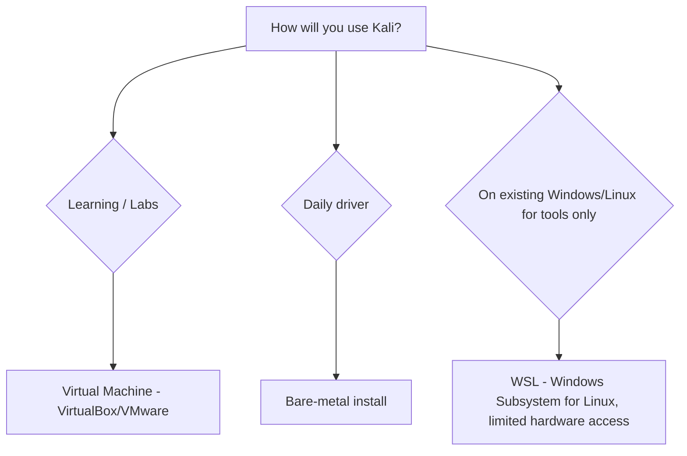

# Installation Methods

> Level: Beginner

## 🎯 Learning Objectives

- Identify the main ways to run Kali Linux
- Choose the right method for a learning environment

## 🧠 Concept

Kali can be run in several ways. For learning and lab work, a **virtual machine** is strongly recommended — it's reversible (snapshots), isolated from your host, and safe to break.



| Method | Best For | Reversible | Hardware Access |
|---|---|---|---|
| Virtual Machine | Learning, labs, this repo | ✅ (snapshots) | Limited (via host) |
| Live USB | Quick testing, forensics | ✅ | Full |
| Bare-metal install | Dedicated security workstation | ❌ | Full |
| WSL | Lightweight CLI tool access on Windows | ✅ | None (no raw networking) |
| Cloud VM | Remote lab access | ✅ | None |

## 💻 Syntax

Not applicable — this is an installation/setup lesson, not a single command.

## 🔍 Examples

Official Kali VM images and the installer ISO are downloaded from `kali.org/get-kali`. After importing a pre-built VM image into VirtualBox or VMware, first boot in and verify:

```bash
uname -a
ip a
```

## 📤 Expected Output

```text
Linux kali 6.x-kali-amd64 #1 SMP ... x86_64 GNU/Linux
```

## 🧩 How It Works

The official Kali VM images come pre-built with VM-tools drivers installed, so a fresh import "just works" for networking and display resolution — this is why the repo's labs (module 34) assume a VM-based setup.

## ⚠️ Common Mistakes

- Downloading Kali ISOs/images from unofficial mirrors — always use `kali.org`
- Installing Kali bare-metal as a first Linux distro (steep learning curve without general Linux fundamentals first — see module 01)
- Skipping VM snapshots before experimenting with system-breaking changes

## 🛠 Troubleshooting

**Problem:** VM has no network after import.
**Diagnosis:** Check the VM's network adapter mode (NAT vs Bridged) in your hypervisor settings, then `ip a` inside the guest.
**Solution:** Switch adapter mode or restart networking (`sudo systemctl restart NetworkManager`).

## 🔐 Security Notes

Always verify the SHA256 checksum of any Kali ISO/VM image against the value published on `kali.org` before use, to confirm it hasn't been tampered with.

## 🧪 Practice

Download the official Kali VM image for your hypervisor, import it, boot it, and run `uname -a` to confirm it booted correctly.

## 📝 Quiz

**Q: For learning and lab work, which installation method is recommended?**
A. Bare-metal install
B. Virtual machine
C. WSL
D. Cloud VM

*(Answer: B)*

## 🔗 Related Topics

- [First Boot and the Kali Desktop](04-kali-desktop-and-first-boot.md)
- [Cybersecurity Lab Environment](../26-network-security-lab/README.md)

---

[⬅ Previous: Kali vs Other Distros](02-kali-vs-other-distros.md)
[🏠 Home](../README.md)
[Next: First Boot and the Kali Desktop ➡](04-kali-desktop-and-first-boot.md)
