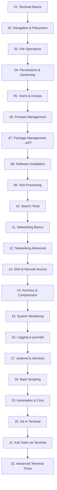

# 🐉 Kali Linux Terminal Mastery

**From Zero to Advanced — Master the Kali Linux Terminal Without Relying on Any Other Source**


---

## 📖 What Is This Repository?

**Kali Linux Terminal Mastery** is a **pure terminal-focused learning repository** designed to take you from complete beginner to advanced Linux terminal user.

The primary focus is **hands-on command-line practice rather than lengthy theory**.

Every command will be explained through:

* What the command does
* Why and when it is used
* Correct syntax
* Practical demonstration
* Expected terminal output
* Line-by-line output explanation
* Important options and flags
* Common mistakes
* Troubleshooting techniques
* Practical exercises

The ultimate goal is simple:

> **After completing this repository, you should be able to confidently use and control the Kali Linux terminal without depending on external tutorials or videos.**

The repository starts from basic terminal navigation and gradually progresses toward advanced administration, networking, automation, scripting, Git, and authorized security-tool usage.

---

# 🗺️ Learning Roadmap



---

# 📚 Complete Module Overview

## 01. Terminal Basics

Learn the fundamentals of working with the Linux command line.

Topics include:

* Opening and understanding the terminal
* Shell vs terminal
* Bash basics
* Command structure
* Command history
* Tab completion
* Clearing the terminal
* Getting help
* `man`
* `--help`
* `history`
* Keyboard shortcuts
* Root vs normal user

---

## 02. Navigation & Filesystem

Understand how the Linux filesystem works and learn how to navigate efficiently.

Topics include:

* Linux filesystem hierarchy
* `/`
* `/home`
* `/root`
* `/etc`
* `/var`
* `/tmp`
* `/usr`
* `/opt`
* `/bin`
* `/sbin`
* `pwd`
* `ls`
* `cd`
* Absolute paths
* Relative paths
* Hidden files
* `~`
* `.`
* `..`

---

## 03. File Operations

Learn how to create, modify, copy, move, rename, and delete files and directories.

Commands include:

* `touch`
* `mkdir`
* `cp`
* `mv`
* `rm`
* `rmdir`
* `cat`
* `less`
* `more`
* `head`
* `tail`
* `file`
* `stat`

Special attention will be given to safe file deletion and recursive operations.

---

## 04. Permissions & Ownership

Understand the Linux permission system and how access control works.

Topics include:

* Read, write, execute permissions
* User, group, and others
* `chmod`
* `chown`
* `chgrp`
* Numeric permissions
* Symbolic permissions
* `umask`
* Special permissions
* SUID
* SGID
* Sticky bit

Example:

```bash
chmod 755 script.sh
```

---

## 05. Users & Groups

Learn how Linux manages users and groups.

Commands include:

* `whoami`
* `id`
* `who`
* `w`
* `users`
* `passwd`
* `useradd`
* `usermod`
* `userdel`
* `groupadd`
* `groupmod`
* `groupdel`
* `groups`
* `su`
* `sudo`

You will also learn the basics of:

* `/etc/passwd`
* `/etc/shadow`
* `/etc/group`
* User IDs
* Group IDs

---

## 06. Process Management

Learn how Linux processes work and how to monitor and control them.

Commands include:

* `ps`
* `top`
* `htop`
* `pgrep`
* `pkill`
* `kill`
* `killall`
* `jobs`
* `bg`
* `fg`
* `nohup`

Topics include:

* Foreground processes
* Background processes
* Process IDs
* Parent and child processes
* Signals
* Process termination

---

## 07. Package Management — APT

Learn how Kali Linux manages software packages.

Commands include:

```bash
apt update
apt upgrade
apt install
apt remove
apt purge
apt search
apt show
apt list
apt autoremove
```

You will learn:

* Repository concepts
* Package indexes
* Installing packages
* Removing packages
* Updating the system
* Troubleshooting dependency problems

---

## 08. Software Installation

Explore different ways to install software on Kali Linux.

Topics include:

* APT packages
* `.deb` packages
* `dpkg`
* Git-based installations
* Source compilation
* Python packages
* Virtual environments
* PATH configuration

Example:

```bash
sudo dpkg -i package.deb
```

---

## 09. Text Processing

Master Linux's powerful command-line text-processing utilities.

Commands include:

* `cat`
* `grep`
* `cut`
* `sort`
* `uniq`
* `tr`
* `wc`
* `sed`
* `awk`
* `tee`

Topics include:

* Searching text
* Filtering output
* Replacing text
* Extracting columns
* Sorting data
* Counting lines and words
* Combining commands

---

## 10. Search Tools

Learn how to efficiently find files, directories, commands, and information.

Commands include:

* `find`
* `locate`
* `which`
* `whereis`
* `type`
* `grep`
* `history`

Example:

```bash
find /home -type f -name "*.txt"
```

---

# 🌐 11. Networking Basics

Build a strong foundation in Linux networking.

Topics include:

* IP addresses
* Interfaces
* MAC addresses
* Default gateway
* DNS
* Routing
* Ports
* TCP/UDP
* Localhost
* Network connectivity

Commands include:

* `ip`
* `ping`
* `ss`
* `hostname`
* `dig`
* `nslookup`
* `curl`
* `wget`
* `traceroute`

---

# 🌐 12. Networking Advanced

Go deeper into Linux networking and troubleshooting.

Topics include:

* Routing tables
* DNS troubleshooting
* Network interfaces
* TCP connections
* Listening ports
* Network statistics
* Packet-level concepts
* Firewall fundamentals

Commands and utilities may include:

* `ip route`
* `ss`
* `tcpdump`
* `nmap` in authorized environments
* `iptables`
* `nft`
* `ufw`

All security-related demonstrations should be performed only against systems you own or are explicitly authorized to test.

---

# 🔐 13. SSH & Remote Access

Learn how to securely access Linux systems remotely.

Topics include:

* SSH fundamentals
* SSH client
* SSH server
* Host keys
* Authentication
* Password authentication
* SSH keys
* `scp`
* `sftp`
* SSH configuration
* Basic SSH hardening

Example:

```bash
ssh username@192.168.1.10
```

---

# 📦 14. Archives & Compression

Learn how to work with compressed files and archives.

Commands include:

* `tar`
* `gzip`
* `gunzip`
* `zip`
* `unzip`
* `xz`
* `7z`

Example:

```bash
tar -czvf backup.tar.gz directory/
```

---

# 📊 15. System Monitoring

Learn how to understand system resource usage.

Topics include:

* CPU usage
* RAM usage
* Disk usage
* Disk I/O
* Running processes
* System uptime
* Load average

Commands include:

* `top`
* `htop`
* `free`
* `df`
* `du`
* `uptime`
* `vmstat`
* `iostat`

---

# 📝 16. Logging & journald

Understand how Linux records system and service activity.

Topics include:

* System logs
* Log files
* `journalctl`
* Kernel messages
* Authentication logs
* Service logs
* Filtering logs by time
* Troubleshooting using logs

Examples:

```bash
journalctl
```

```bash
journalctl -u ssh
```

---

# ⚙️ 17. systemd & Services

Learn how modern Linux systems manage services and startup processes.

Commands include:

```bash
systemctl status
systemctl start
systemctl stop
systemctl restart
systemctl enable
systemctl disable
```

Topics include:

* Services
* Units
* Service status
* Startup services
* Service failures
* Boot-time services

---

# 🐚 18. Bash Scripting

Move from individual commands to automation through Bash scripting.

Topics include:

* Variables
* Input
* Output
* Conditions
* Loops
* Functions
* Arguments
* Exit codes
* Arrays
* Command substitution
* Redirection
* Pipes

Example:

```bash
#!/bin/bash

echo "Hello, Kali Linux!"
```

More advanced scripts will gradually introduce real-world automation concepts.

---

# ⏰ 19. Automation & Cron

Learn how to automate repetitive tasks.

Topics include:

* `cron`
* `crontab`
* `at`
* Scheduled scripts
* Automated backups
* Log cleanup
* Periodic system tasks

Example:

```bash
crontab -e
```

---

# 🌳 20. Git in Terminal

Learn Git entirely from the command line.

Topics include:

* Git fundamentals
* Repository creation
* Clone
* Status
* Add
* Commit
* Branches
* Merge
* Remote repositories
* Pull
* Push
* Fetch
* Conflict resolution
* Git history

Common commands:

```bash
git init
git clone
git status
git add
git commit
git branch
git switch
git merge
git pull
git push
git log
```

---

# 🛡️ 21. Kali Tools via Terminal

Explore Kali Linux's security-oriented tools from the command line.

This module focuses on **understanding tools, command syntax, output interpretation, and safe laboratory practice**.

Possible topics include:

* Network discovery
* Port scanning
* Service enumeration
* Packet analysis
* Web security testing concepts
* Password-security auditing concepts
* Digital forensics utilities
* Wireless security concepts
* Vulnerability assessment concepts

Examples will be performed only in:

* Your own Kali VM
* Local virtual labs
* CTF platforms
* Intentionally vulnerable applications
* Systems for which you have explicit authorization

No unauthorized scanning, exploitation, credential attacks, or access to third-party systems will be performed.

---

# 🚀 22. Advanced Terminal Tricks

The final module brings everything together.

Topics include:

* Advanced pipes
* Command chaining
* Redirection
* Process substitution
* Command substitution
* Aliases
* Functions
* Environment variables
* PATH manipulation
* Shell customization
* One-liners
* Advanced Bash techniques
* Terminal productivity
* Debugging shell scripts
* Efficient command combinations

The goal is to make you **fast, efficient, and confident at the command line**.

---

# 📂 Repository Structure

```text
Kali-Linux-Terminal-Mastery/

│
├── README.md
│
├── command-reference/
│   └── 00-master-command-index.md
│
├── resources/
│   └── videos-and-websites.md
│
├── assets/
│   ├── screenshots/
│   └── diagrams/
│
├── 01-terminal-basics/
├── 02-navigation-filesystem/
├── 03-file-operations/
├── 04-permissions-ownership/
├── 05-users-groups/
├── 06-process-management/
├── 07-package-management-apt/
├── 08-software-installation/
├── 09-text-processing/
├── 10-search-tools/
├── 11-networking-basics/
├── 12-networking-advanced/
├── 13-ssh-remote-access/
├── 14-archives-compression/
├── 15-system-monitoring/
├── 16-logging-journald/
├── 17-systemd-services/
├── 18-bash-scripting/
├── 19-automation-cron/
├── 20-git-terminal/
├── 21-kali-tools-terminal/
└── 22-advanced-terminal-tricks/
```

---

# 🔑 Command Reference

The most important quick-reference file is:

👉 [`command-reference/00-master-command-index.md`](command-reference/00-master-command-index.md)

This file will contain a categorized index of commands covered throughout the repository.

Each entry will include:

```text
Command
    ↓
One-line description
    ↓
Common options
    ↓
Module containing the full lesson
```

Use it as a **quick cheat sheet** while working through the repository.

---

# 🎥 Learning Resources

Additional learning materials will be maintained here:

👉 [`resources/videos-and-websites.md`](resources/videos-and-websites.md)

Resources may include:

* Official documentation
* Linux documentation
* Kali Linux documentation
* Bash documentation
* Recommended video channels
* Practice platforms
* CTF platforms
* Reference websites

External resources are supplementary. The main lessons in this repository are designed to remain self-contained.

---

# 🧪 Practice Philosophy

Reading commands is not enough.

For every lesson:

1. Read what the command does.
2. Understand the syntax.
3. Type the command yourself.
4. Observe the output.
5. Change the options.
6. Try a small experiment.
7. Intentionally make a safe mistake.
8. Understand the error message.
9. Fix the problem.
10. Complete the exercise.

The objective is **practical command-line fluency**, not memorization.

---

# 📝 Standard Lesson Format

Every command lesson should follow a consistent structure:

```markdown
# command_name

**What it does:** ...

**Why it is used:** ...

**Syntax:**
`command [options] [arguments]`

## 🖥️ Demo

$ actual command

(actual output)

## 📤 Output Explanation

...

## ⚙️ Important Options

...

## 💡 Practical Examples

...

## ⚠️ Common Mistakes

...

## 🔧 Troubleshooting

...

## 🧪 Practice Exercise

...

## 🔐 Security / Safety Notes

...
```

This structure ensures that every command is explained from both a beginner and practical perspective.

---

# 🎯 Learning Objectives

After completing the repository, you should be able to:

* Navigate the Linux filesystem confidently
* Create and manage files and directories
* Understand Linux permissions
* Manage users and groups
* Monitor and control processes
* Install and manage software using APT
* Search and manipulate text from the terminal
* Diagnose common networking problems
* Work with SSH
* Monitor system resources
* Read and analyze system logs
* Manage systemd services
* Write Bash scripts
* Automate repetitive tasks
* Use Git from the command line
* Understand and safely use Kali security tools
* Combine multiple Linux commands efficiently
* Troubleshoot common terminal problems independently

---

# ⚠️ Authorized Use Only

Kali Linux contains powerful security and administration tools.

All security-related exercises in this repository must be performed only in environments where you have explicit authorization.

Recommended practice environments include:

* Your own computer
* Your own virtual machines
* Isolated home labs
* CTF platforms
* Intentionally vulnerable applications
* Authorized penetration-testing environments

**Never use these techniques against systems, networks, accounts, or websites without permission.**

The purpose of this repository is **education, system administration, defensive security, and authorized security testing**.

---

# 🧭 How to Start

Start here:

👉 [`01-terminal-basics/README.md`](01-terminal-basics/README.md)

Then follow the modules sequentially.

### Recommended Workflow

```text
01. Learn
      ↓
02. Type the command yourself
      ↓
03. Understand the output
      ↓
04. Experiment safely
      ↓
05. Complete the exercise
      ↓
06. Move to the next lesson
```

Do not skip the fundamentals.

The advanced modules become significantly easier once you understand the basic Linux command-line concepts.

---

# ⭐ Repository Philosophy

> **Learn the command. Understand the output. Break it safely. Fix it yourself. Master the terminal.**

This repository is built around one principle:

**Don't just memorize commands — understand what Linux is doing.**

---

# 👤 Maintainer

Maintained by **Atia**

GitHub: [AtiaAbk](https://github.com/AtiaAbk)

---

## ⭐ If This Repository Helps You

If you find this project useful:

* ⭐ Star the repository
* 🍴 Fork it
* 🐛 Report issues
* 💡 Suggest improvements
* 📚 Contribute new lessons
* 🔧 Share useful corrections

Let's build a complete, practical, and beginner-friendly **Kali Linux Terminal Mastery** resource together.
