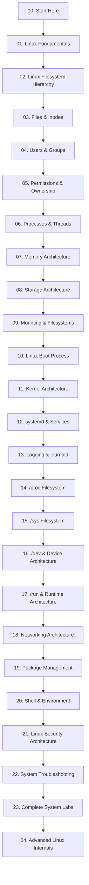

# 🐉 Kali Linux System & Filesystem Mastery

### **From Zero to Advanced — Understand Kali Linux From the Inside Out**


---

# 📖 Welcome

**Kali Linux System & Filesystem Mastery** is a complete, beginner-friendly learning platform designed to explain **how Kali Linux works internally**.

This repository is not simply a collection of Linux notes.

It is designed as a **self-contained Linux learning platform** where a learner can start with absolutely no knowledge of Linux and gradually understand:

* Linux filesystem
* Directory structure
* Files and inodes
* Linux kernel
* User space and kernel space
* Boot process
* Processes and threads
* Memory management
* Storage architecture
* Partitions and filesystems
* Mounting
* Users and groups
* Permissions
* Authentication
* Networking architecture
* Package management
* systemd
* Services
* Logging
* `/proc`
* `/sys`
* `/dev`
* `/run`
* Environment variables
* Shell architecture
* System configuration
* Security fundamentals
* Troubleshooting

The goal is not to make you memorize commands.

> **The goal is to make you understand what is actually happening inside Linux.**


# 🗺️ Complete Learning Roadmap


---

# 🌳 01 — Linux Filesystem Hierarchy

The Linux filesystem is organized as a tree.

Everything starts from:

```text
/
```

The repository explains the entire tree:

```text
/
├── bin
├── boot
├── dev
├── etc
├── home
├── lib
├── media
├── mnt
├── opt
├── proc
├── root
├── run
├── sbin
├── srv
├── sys
├── tmp
├── usr
└── var
```

Every directory receives its own dedicated lesson.

---

# 📁 `/`

## What is `/`?

`/` is the root of the Linux filesystem hierarchy.

It is not the same thing as `/root`.

```text
/
└── root
```

The first is the filesystem root.

The second is the home directory of the root user.

This distinction is explained clearly in the repository.

---

# 📁 `/bin`

Contains essential executable programs required for normal system operation.

Topics include:

* What binaries are
* Executable files
* PATH
* Essential commands
* Modern merged-`/usr` systems

---

# 📁 `/sbin`

Contains system administration utilities.

The repository explains:

* Why administrative binaries exist
* Historical `/sbin` usage
* Modern merged-`/usr` layouts

---

# 📁 `/boot`

Contains files required during system startup.

Topics include:

* Linux kernel
* initramfs
* GRUB configuration
* Bootloader files
* Kernel images
* Boot sequence

---

# 📁 `/dev`

Linux represents devices through special files.

Examples:

```text
/dev/sda
/dev/null
/dev/zero
/dev/random
/dev/tty
```

The lesson explains:

* Device files
* Character devices
* Block devices
* Major/minor numbers
* udev
* Device discovery

---

# 📁 `/etc`

The central configuration area.

Important examples:

```text
/etc/passwd
/etc/shadow
/etc/hosts
/etc/hostname
/etc/fstab
/etc/ssh/
/etc/systemd/
/etc/apt/
```

Each important configuration file gets its own explanation.

---

# 📁 `/home`

Contains normal users' home directories.

Example:

```text
/home/
├── alice/
├── bob/
└── user/
```

Explain:

* Home directories
* Hidden files
* User configuration
* `.bashrc`
* `.profile`
* Permissions

---

# 📁 `/lib`

Contains shared libraries and essential kernel-related files.

Topics:

* Shared libraries
* Dynamic linking
* `.so` files
* Architecture-specific libraries
* Loader concepts

---

# 📁 `/media`

Common mount location for removable media.

Examples:

* USB drives
* External storage
* Automatically mounted devices

---

# 📁 `/mnt`

Traditional temporary mount location.

Explain the difference between:

```text
/mnt
/media
```

---

# 📁 `/opt`

Used for optional/additional software.

Explain:

* Third-party applications
* Application-specific directories
* Why software may use `/opt`

---

# 📁 `/proc`

One of the most important Linux virtual filesystems.

Examples:

```bash
cat /proc/cpuinfo
cat /proc/meminfo
cat /proc/version
```

Explain:

```text
/proc
   ↓
Virtual filesystem
   ↓
Kernel information
   ↓
Process information
```

---

# 📁 `/root`

Home directory of the root user.

Important distinction:

```text
/
```

Filesystem root.

```text
/root
```

Root user's home.

---

# 📁 `/run`

Contains runtime information created during the current boot session.

Examples include:

* PID information
* Sockets
* Runtime state
* Service runtime data

---

# 📁 `/srv`

Contains data intended to be served by system services.

Examples:

* Web server data
* FTP data
* Application service data

---

# 📁 `/sys`

Another virtual filesystem exposing information about:

* Hardware
* Devices
* Drivers
* Kernel subsystems
* System configuration

---

# 📁 `/tmp`

Temporary files.

Explain:

* Temporary data
* Permissions
* Sticky bit
* Cleanup behavior
* Security considerations

---

# 📁 `/usr`

One of the largest and most important parts of a Linux installation.

Typical structure:

```text
/usr
├── bin
├── sbin
├── lib
├── share
├── include
└── local
```

Explain:

* `/usr/bin`
* `/usr/sbin`
* `/usr/lib`
* `/usr/share`
* `/usr/local`

---

# 📁 `/var`

Stores variable data.

Important areas:

```text
/var/log
/var/cache
/var/lib
/var/tmp
/var/spool
```

Explain what each one does.

---

# 🔗 02 — Files, Inodes & Links

A major goal of this repository is to make learners understand that a Linux file is more than its filename.

Explain:

```text
Filename
   ↓
Directory entry
   ↓
Inode
   ↓
File metadata
   ↓
Data blocks
```

Topics:

* Regular files
* Directories
* Inodes
* File metadata
* Hard links
* Symbolic links
* File descriptors
* Open files

Commands:

```bash
ls -li
stat file.txt
ln
ln -s
lsof
```

---

# 👥 03 — Users & Groups

Explain the Linux identity model.

```text
User
 ↓
UID
 ↓
Primary Group
 ↓
Supplementary Groups
 ↓
Permissions
```

Important files:

```text
/etc/passwd
/etc/shadow
/etc/group
```

Topics:

* Root
* Normal users
* UID
* GID
* Groups
* Login shells
* User configuration

---

# 🔐 04 — Permissions & Ownership

Explain:

```text
-rwxr-xr--
```

Character by character.

Then explain:

```text
Owner
Group
Others
```

Topics:

* Read
* Write
* Execute
* chmod
* chown
* chgrp
* umask
* SUID
* SGID
* Sticky bit
* ACL
* Capabilities

---

# 🔄 05 — Process Architecture

Explain what happens when you execute:

```bash
ls
```

Conceptually:

```text
Shell
 ↓
fork()
 ↓
exec()
 ↓
Program
 ↓
Kernel
 ↓
CPU
```

Topics:

* PID
* PPID
* Process states
* Process tree
* Parent process
* Child process
* Fork
* Exec
* Wait
* Exit
* Signals
* Daemons
* Zombie processes
* Orphan processes
* Threads

---

# 🧠 06 — Memory Architecture

Explain the relationship:

```text
Application
      ↓
Virtual Memory
      ↓
Page Tables
      ↓
Physical RAM
      ↓
CPU
```

Explain:

* RAM
* Virtual memory
* Pages
* Page tables
* Address spaces
* Heap
* Stack
* Code segment
* Data segment
* Shared memory
* Swap
* OOM killer

Useful commands:

```bash
free -h
vmstat
cat /proc/meminfo
```

---

# 💾 07 — Storage Architecture

Explain the complete storage chain:

```text
Physical Disk
      ↓
Partition Table
      ↓
Partition
      ↓
Filesystem
      ↓
Mount Point
      ↓
Directory Tree
      ↓
Files
```

Topics:

* HDD
* SSD
* NVMe
* Block devices
* Partitions
* MBR
* GPT
* Filesystems
* ext4
* UUID
* Mounting
* Swap

Commands:

```bash
lsblk
blkid
fdisk
parted
df -h
du -sh
```

---

# 🔗 08 — Mounting Architecture

Explain why Linux does not use drive letters like:

```text
C:
D:
E:
```

Instead:

```text
/
├── home
├── boot
├── var
└── mnt
```

Explain:

* Mount points
* Mounting
* Unmounting
* `/etc/fstab`
* UUID
* Bind mounts
* Temporary mounts

---

# 🚀 09 — Linux Boot Process

The complete boot flow:

```text
Power On
   ↓
Firmware
   ↓
UEFI / BIOS
   ↓
Bootloader
   ↓
GRUB
   ↓
Linux Kernel
   ↓
initramfs
   ↓
PID 1
   ↓
systemd
   ↓
Services
   ↓
Login Manager
   ↓
Shell / Desktop
```

Every stage gets a dedicated lesson.

---

# ⚙️ 10 — Kernel Architecture

Explain the kernel as the bridge between applications and hardware.

```text
Applications
      ↓
Libraries
      ↓
System Calls
      ↓
Linux Kernel
      ↓
Drivers
      ↓
Hardware
```

Topics:

* Kernel space
* User space
* System calls
* Scheduler
* Memory manager
* VFS
* Device drivers
* Networking stack
* Kernel modules

---

# ⚙️ 11 — systemd Architecture

Explain:

```text
systemd
  |
  ├── Services
  ├── Targets
  ├── Timers
  ├── Sockets
  └── Dependencies
```

Topics:

* PID 1
* Units
* Services
* Targets
* Timers
* Dependencies
* Startup
* Shutdown

Commands:

```bash
systemctl status
systemctl list-units
systemctl list-dependencies
journalctl
```

---

# 📜 12 — Logging Architecture

Explain how system activity becomes logs.

```text
Kernel
   ↓
Services
   ↓
journald / logging system
   ↓
Journal / log files
   ↓
Administrator
```

Topics:

* `/var/log`
* journald
* journalctl
* dmesg
* Authentication logs
* Service logs
* Boot logs

---

# 🔬 13 — `/proc`

Explain `/proc` as a virtual interface to kernel and process information.

Examples:

```bash
cat /proc/cpuinfo
cat /proc/meminfo
cat /proc/uptime
cat /proc/version
```

Process-specific directories:

```text
/proc/1
/proc/1000
/proc/2000
```

Explain how PID directories expose process information.

---

# 🔬 14 — `/sys`

Explain how `/sys` exposes the kernel's device and subsystem model.

Topics:

* Devices
* Drivers
* Classes
* Block devices
* Network devices
* Kernel parameters

Example:

```bash
ls /sys/class/net
```

---

# 🖥️ 15 — `/dev`

Explain device abstraction.

```text
Application
     ↓
Device File
     ↓
Kernel
     ↓
Driver
     ↓
Hardware
```

Topics:

* Character devices
* Block devices
* `/dev/null`
* `/dev/zero`
* `/dev/random`
* Disk devices
* TTY devices
* udev

---

# 🏃 16 — `/run`

Explain runtime state.

Topics:

* PID files
* UNIX sockets
* Service runtime data
* Boot-session data
* Temporary runtime state

---

# 🌐 17 — Networking Architecture

Explain the entire Linux network path.

```text
Application
    ↓
Socket
    ↓
TCP / UDP
    ↓
IP
    ↓
Routing
    ↓
Network Interface
    ↓
Driver
    ↓
Hardware
```

Topics:

* MAC
* IP
* Interfaces
* Routing
* ARP
* DNS
* DHCP
* TCP
* UDP
* Ports
* Sockets

Commands:

```bash
ip addr
ip route
ss
ping
dig
curl
```

---

# 📦 18 — Package Management

Explain:

```text
Repository
    ↓
APT
    ↓
Package Metadata
    ↓
Dependency Resolution
    ↓
.deb Package
    ↓
dpkg
    ↓
Installed Files
```

Topics:

* APT
* dpkg
* Repositories
* Package metadata
* Dependencies
* Package cache
* Installed package database

---

# 🐚 19 — Shell & Environment

Explain the difference between:

```text
Terminal
Shell
Bash
Command
Process
```

Topics:

* Bash
* Shell
* Environment variables
* PATH
* `.bashrc`
* `.profile`
* Aliases
* Functions
* Pipes
* Redirection
* Command substitution

---

# 🛡️ 20 — Linux Security Architecture

Security concepts are explained from an operating-system perspective.

Topics:

* Authentication
* Authorization
* Users
* Groups
* Permissions
* sudo
* PAM
* ACL
* Capabilities
* SUID
* SGID
* Security boundaries

The focus is on understanding and defending systems.

---

# 🔧 21 — System Troubleshooting

This section teaches learners how to diagnose problems logically.

Instead of:

> "Something is broken."

Use:

```text
Observe
   ↓
Identify
   ↓
Collect Information
   ↓
Check Logs
   ↓
Check Processes
   ↓
Check Services
   ↓
Check Network
   ↓
Find Root Cause
   ↓
Apply Fix
   ↓
Verify
```

Troubleshooting labs cover:

* Boot problems
* Network problems
* Permission problems
* Disk problems
* Service failures
* Process problems
* Package problems
* Filesystem problems

---

# 🧪 22 — Hands-On Labs

Every major chapter includes practical exercises.

Example:

## Filesystem Lab

```text
Task 1
Explore the root filesystem.

Task 2
Identify the purpose of each major directory.

Task 3
Find configuration files.

Task 4
Inspect /var/log.

Task 5
Explore /proc.

Task 6
Explore /sys.

Task 7
Identify mounted filesystems.
```

---

# 🧪 Lab Design Philosophy

Every lab should contain:

```text
🎯 Objective
📋 Requirements
🧠 Background
💻 Commands
📤 Expected Output
🔍 Output Explanation
🧪 Tasks
⚠️ Common Mistakes
🔧 Troubleshooting
✅ Solution
🏁 What You Learned
```

---

# 📸 Visual Learning

This repository should be highly visual.

Important concepts should have diagrams whenever possible.

Examples:

* Filesystem tree
* Boot process
* Kernel architecture
* Memory layout
* Process tree
* Storage stack
* Network stack
* Permission model
* systemd architecture
* Package-management architecture

Recommended asset structure:

```text
assets/
│
├── architecture/
├── filesystem/
├── boot/
├── memory/
├── storage/
├── networking/
├── permissions/
├── systemd/
├── screenshots/
└── diagrams/
```

---

# 📝 Standard Lesson Template

Every lesson should follow the same structure.

```markdown
# Topic Name

## 📖 What Is It?

Simple beginner-friendly explanation.

## 🎯 Why Does It Matter?

Real-world importance.

## 🧠 Prerequisites

What the learner should know first.

## 🏗️ Architecture

Diagram explaining how it works.

## 📂 Where Is It Located?

Filesystem location.

## ⚙️ How Does It Work?

Internal explanation.

## 💻 Practical Demonstration

Commands and examples.

## 📤 Expected Output

Real terminal output.

## 🔍 Output Breakdown

Explain every important line.

## 🔬 Under the Hood

Explain what Linux is doing internally.

## 💡 Real-World Example

Practical scenario.

## ⚠️ Common Mistakes

Typical beginner mistakes.

## 🔧 Troubleshooting

Common problems and solutions.

## 🧪 Practice Lab

Hands-on exercise.

## 📝 Quick Revision

Important points.

## 🎯 Knowledge Check

Questions to test understanding.

## 🔗 Related Topics

Links to connected lessons.
```

---

# 🧩 Knowledge Check System

Each major chapter should finish with questions.

Example:

### Beginner

* What is `/`?
* What is `/home`?
* What is `/etc`?

### Intermediate

* What is an inode?
* What is the difference between a hard link and a symbolic link?
* What is PID 1?

### Advanced

* How does a system call move execution from user space to kernel space?
* How does a process obtain its virtual address space?
* How does a filesystem become accessible through the Linux directory tree?

---

# 🏆 Learning Levels

The platform uses four levels.

```text
🟢 LEVEL 1 — Beginner
Linux Fundamentals
Filesystem
Basic Processes
Users

        ↓

🔵 LEVEL 2 — Intermediate
Permissions
Storage
Networking
systemd
Logging

        ↓

🟣 LEVEL 3 — Advanced
Kernel
Memory
VFS
/proc
/sys
Networking Internals

        ↓

🔴 LEVEL 4 — Expert
Namespaces
cgroups
Containers
Kernel Modules
Advanced Troubleshooting
Linux Internals
```

---

# 🧭 Recommended Learning Method

Do not rush through the repository.

For every topic:

```text
1. Read
   ↓
2. Look at the diagram
   ↓
3. Run the commands
   ↓
4. Inspect the output
   ↓
5. Read the internal explanation
   ↓
6. Complete the lab
   ↓
7. Answer the knowledge check
   ↓
8. Move forward
```

---

# 🧠 Core Philosophy

This repository follows one principle:

> **Don't memorize Linux. Understand Linux.**

If you understand:

```text
Filesystem
+
Kernel
+
Processes
+
Memory
+
Storage
+
Networking
+
Users
+
Permissions
+
Services
+
Logs
```

then Linux commands become much easier to learn.

---

# 🔗 Relationship Between Major Components

The learner should eventually understand this complete picture:

```text
                    USER
                     │
                     ▼
                Applications
                     │
                     ▼
                  Shell
                     │
                     ▼
              System Libraries
                     │
                     ▼
               System Calls
                     │
                     ▼
              ┌──────────────┐
              │    KERNEL    │
              ├──────────────┤
              │ Scheduler    │
              │ Memory       │
              │ VFS          │
              │ Networking   │
              │ Drivers      │
              └──────────────┘
                │     │     │
                ▼     ▼     ▼
              CPU    RAM   Devices
                       │
                       ▼
                    Storage
                       │
                       ▼
                  Filesystems
                       │
                       ▼
                Linux Directory Tree
```

This architecture is the foundation of the entire repository.

---

# 🔎 Master Command Reference

A separate command reference will connect commands to the concepts they operate on.

```text
command-reference/
│
├── filesystem-commands.md
├── process-commands.md
├── memory-commands.md
├── storage-commands.md
├── networking-commands.md
├── permission-commands.md
├── systemd-commands.md
├── logging-commands.md
└── master-command-index.md
```

Each command should link back to its full lesson.

---

# 🧪 Safe Practice Environment

The recommended environment is:

```text
Host Machine
      │
      ▼
Virtual Machine
      │
      ▼
Kali Linux
      │
      ├── Practice
      ├── Experiments
      ├── Troubleshooting
      └── Labs
```

Learners should preferably perform experiments inside a disposable VM or another authorized environment.

---

# ⚠️ Safety & Responsible Use

Kali Linux contains powerful system-administration and security tools.

All experiments must be performed on systems that you own or have explicit authorization to test.

Recommended environments:

* Personal Kali VM
* Personal Linux machine
* Isolated home lab
* CTF platforms
* Intentionally vulnerable applications
* Authorized training environments

Never use techniques from this repository against systems, accounts, networks, or websites without permission.

This repository is intended for:

* Education
* Linux administration
* Defensive security
* Authorized security testing
* Research
* Laboratory practice

---

# 📈 Progress Tracking

A learner can track progress using:

```text
[ ] 00 — Start Here
[ ] 01 — Linux Fundamentals
[ ] 02 — Filesystem Hierarchy
[ ] 03 — Files & Inodes
[ ] 04 — Users & Groups
[ ] 05 — Permissions
[ ] 06 — Processes
[ ] 07 — Memory
[ ] 08 — Storage
[ ] 09 — Mounting
[ ] 10 — Boot Process
[ ] 11 — Kernel Architecture
[ ] 12 — systemd
[ ] 13 — Logging
[ ] 14 — /proc
[ ] 15 — /sys
[ ] 16 — /dev
[ ] 17 — /run
[ ] 18 — Networking
[ ] 19 — Package Management
[ ] 20 — Shell & Environment
[ ] 21 — Security Architecture
[ ] 22 — Troubleshooting
[ ] 23 — Labs
[ ] 24 — Advanced Internals
```

---

# 🎓 Final Learning Outcome

After completing the entire platform, the learner should be able to explain a Kali Linux system from the outside to the inside:

```text
USER
 ↓
APPLICATION
 ↓
SHELL
 ↓
LIBRARIES
 ↓
SYSTEM CALLS
 ↓
KERNEL
 ↓
PROCESSES
 ↓
MEMORY
 ↓
VFS
 ↓
FILESYSTEM
 ↓
STORAGE
 ↓
DRIVERS
 ↓
HARDWARE
```

And understand how the following pieces connect:

```text
Boot
 ↓
Kernel
 ↓
systemd
 ↓
Services
 ↓
Users
 ↓
Shell
 ↓
Applications
 ↓
Files
 ↓
Storage
```

---

# 🌟 The Ultimate Goal

This project is not designed to teach someone:

> "Here are 100 Linux commands."

It is designed to teach:

> **"Here is how an entire Linux operating system works."**

By the end, the learner should be able to open a Kali Linux terminal, inspect the filesystem, investigate processes, understand memory and storage, trace network configuration, inspect services and logs, diagnose problems, and explain **why the system behaves the way it does**.

---

# 👤 Maintainer

Maintained by **Atia**

GitHub: **[AtiaAbk](https://github.com/AtiaAbk)**

---

# ⭐ Support the Project

If this project helps you learn Linux:

* ⭐ Star the repository
* 🍴 Fork the repository
* 🐛 Report issues
* 💡 Suggest improvements
* 📚 Contribute lessons
* 🔧 Submit corrections
* 📖 Share the project with other learners

---

# 🐉 Final Philosophy

```text
Learn Linux
     ↓
Understand Linux
     ↓
Explore Linux
     ↓
Break Linux Safely
     ↓
Troubleshoot Linux
     ↓
Master Linux
```

> **Understand the system. Don't just use the system.**

### 🐉 Kali Linux System & Filesystem Mastery

**From Zero → Understanding → Internals → Advanced Linux**

---
